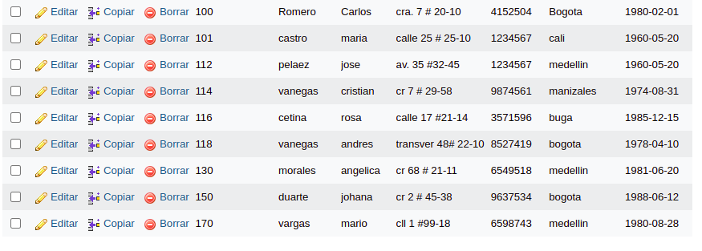
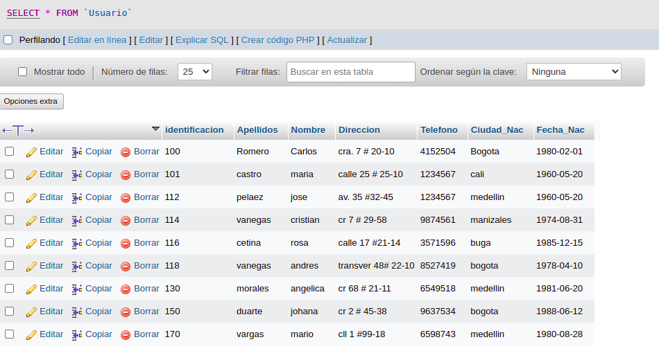
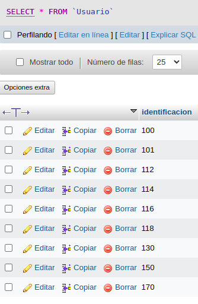

# consultas1_sql

# EJERCICIOS CONSULTAS SQL

#CONSULTAS SQL

1. Para visualizar toda la información que contiene la tabla `usuario` se puede incluir con la instrucción SELECT el caracter '*' o cada uno de los campos de la tabla

`select * from usuario`

2. Visualizar solamente la indentificación del usuario

`select identificacion from usuario`

