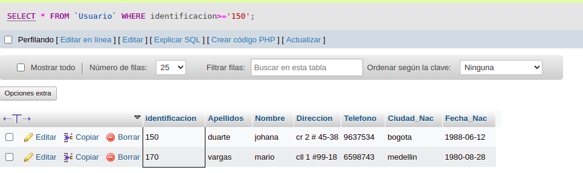
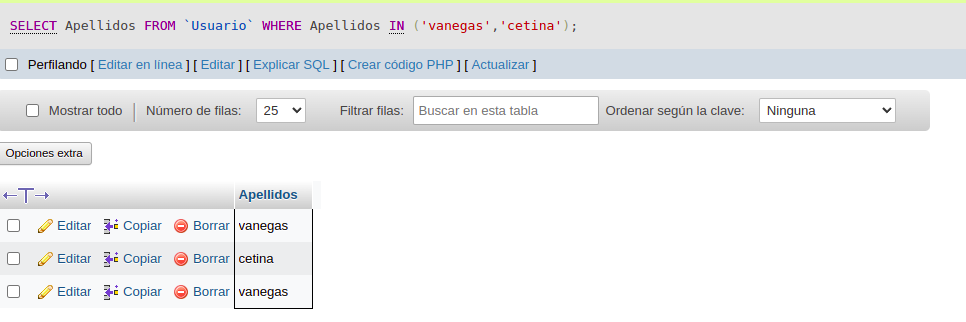
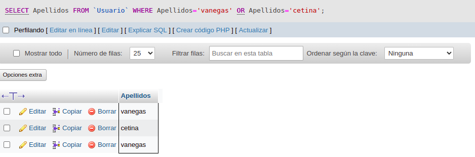
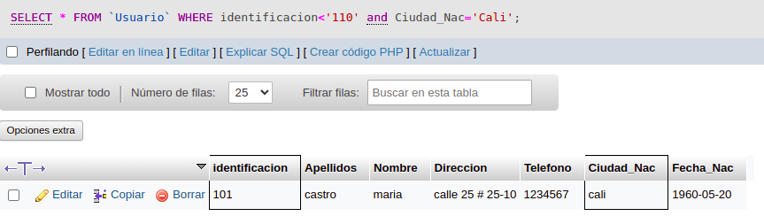

# consultas1_sql

# EJERCICIOS CONSULTAS SQL

#CONSULTAS SQL

1. Para visualizar toda la información que contiene la tabla `usuario` se puede incluir con la instrucción SELECT el caracter '*' o cada uno de los campos de la tabla

`select * from usuario`

2. Visualizar solamente la indentificación del usuario

`select identificacion from usuario`

3. Si se desea obtener los registros cuya identificación sean mayores o iguales a 150; se debe utilizar la clausula WHERE que especifica las condiciones que deben los registros que se van a seleccionar.

`SELECT * FROM usuario WHERE identificacion>=`150`

4. Si se desea obtener los registros cuyosus apellidos sean Vanegas o Cetina, se debe utilizar el operador IN que especifica los registros que se quieren visualizar de una tabla.

`SELECT apellidos FROM usuario WHERE apellidos IN ('Vanegas','Cetina')`

`SELECT apellidos FROM usuario WHERE apellidos='Vanegas' OR apellidos='cetina'`

5. Si se desea obtener los registros cuya identificación sea menor de '110' y la ciudad sea 'Cali' se debe utilizar el operador AND.

`SELECT * FROM usuario WHERE identificacion<'110' AND ciudad_nac='Cali'`

