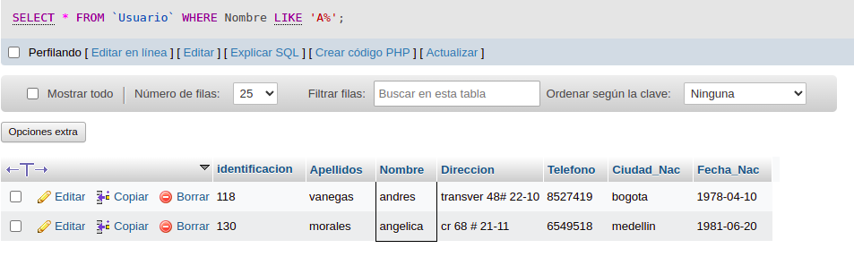
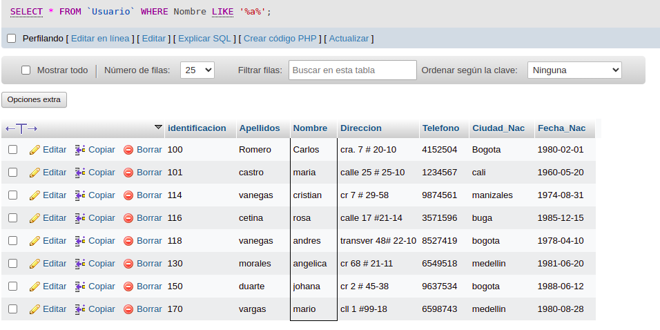
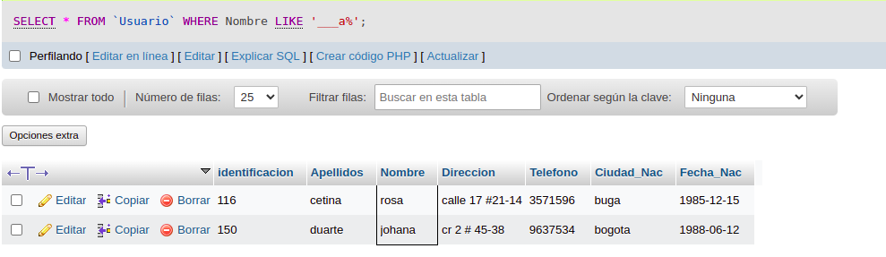
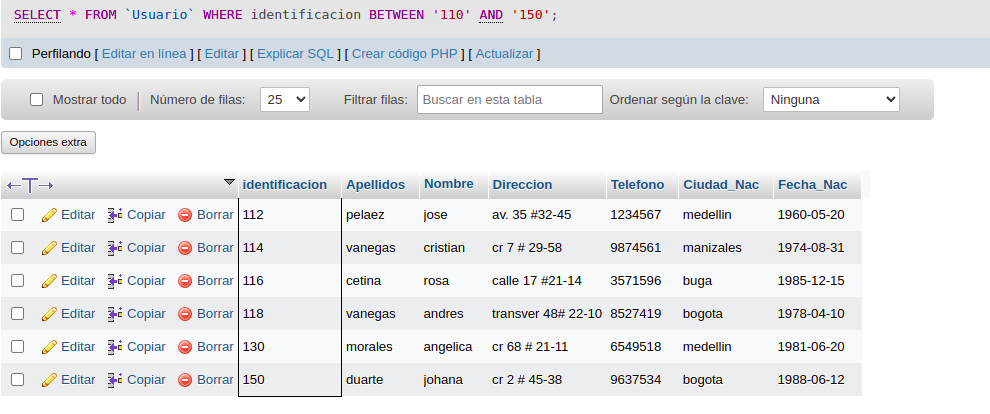
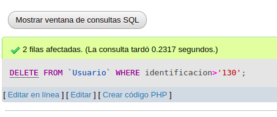
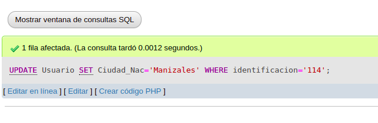
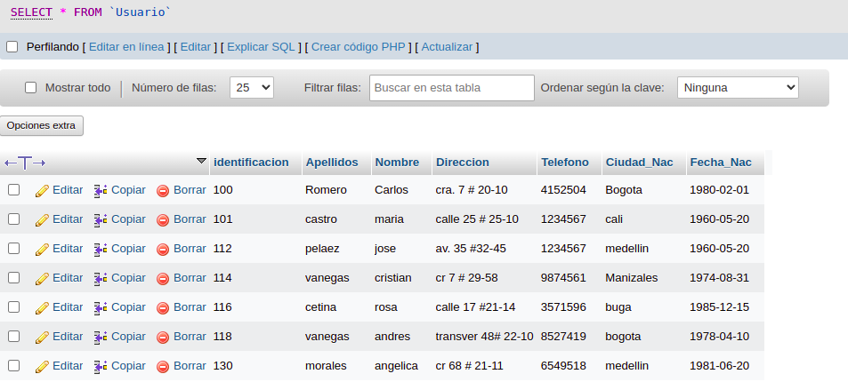
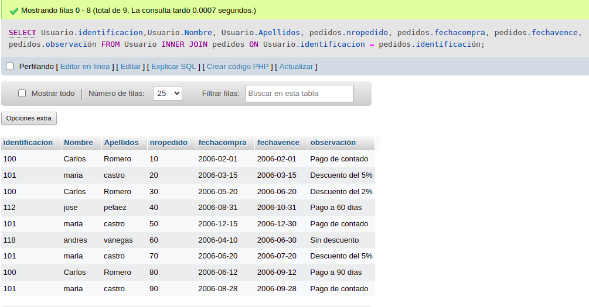
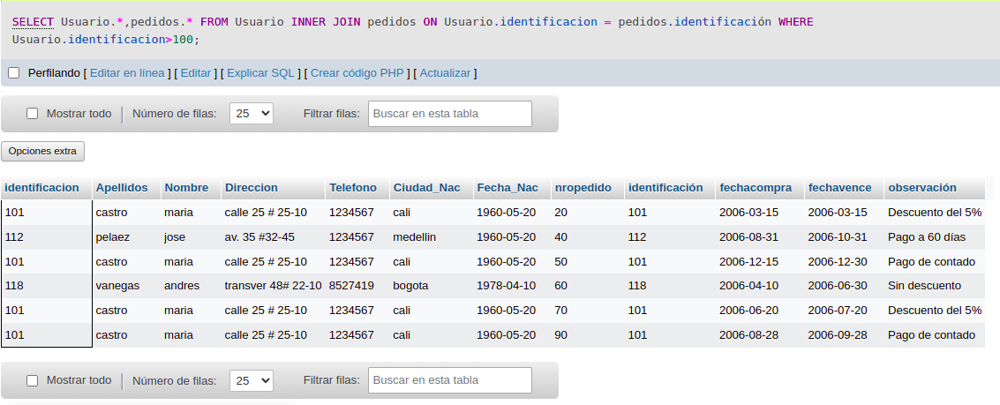

# consultas1_sql

# EJERCICIOS CONSULTAS SQL

#CONSULTAS SQL

## COMANDO SELECT

1. Para visualizar toda la información que contiene la tabla `usuario` se puede incluir con la instrucción SELECT el caracter '*' o cada uno de los campos de la tabla

`select * from usuario`

2. Visualizar solamente la indentificación del usuario

`select identificacion from usuario`

3. Si se desea obtener los registros cuya identificación sean mayores o iguales a 150; se debe utilizar la clausula WHERE que especifica las condiciones que deben los registros que se van a seleccionar.

`SELECT * FROM usuario WHERE identificacion>=`150`

4. Si se desea obtener los registros cuyosus apellidos sean Vanegas o Cetina, se debe utilizar el operador IN que especifica los registros que se quieren visualizar de una tabla.

`SELECT apellidos FROM usuario WHERE apellidos IN ('Vanegas','Cetina')`

`SELECT apellidos FROM usuario WHERE apellidos='Vanegas' OR apellidos='cetina'`

5. Si se desea obtener los registros cuya identificación sea menor de '110' y la ciudad sea 'Cali' se debe utilizar el operador AND.

`SELECT * FROM usuario WHERE identificacion<'110' AND ciudad_nac='Cali'`

6. Si se desea obtener los registros cuyos nombres empiecen por la letra 'A', se debe utilizar el operador LIKE que utiliza los patrones '%' (todos) y '_' (caracter).

`SELECT * FROM usuario WHERE nombre LIKE 'A%'`

7. Si se desea obtener los registros cuos nombres contengan la letra 'a'.
`SELECT * FROM usuario WHERE nombre LIKE '%a%'`

8. Si se desea obtener los registros donde la cuarta letra del nombre sea una 'a'.

`SELECT * FROM usuario WHERE nombre LIKE '___a%'`

9. Si se desea obtener los registros cuya identificacion este en el inventario 110 y 150, se debee utilizar la cláusula BETWEEN, que sirve para especificar un intervalo de valores.

`SELECT * FROM usuario WHERE Identificación BETWEEN '110' and '150'`

## COMANDO DELETE

10. Para eliminar solamente los registros cuya identifiacion sea mayor de 130.

`DELETE FROM usuario WHERE identificación>'130'`

## COMANDO UPDATE

11. Para actualizar la ciudad de nacimiento de cristian vanegas, cuya identificación es 114.

`UPDATE usuario SET ciudad nac = 'Manizalez' WHERE Identificación='114'`

## INNER JOIN

Permite obtener datos de dos o mas tablas. Cuando se realiza la concatenación de las tablas, no necesariamente se deben mostrar todos los datos de las tablas.

## Tabla pedidos

12. Para visualizar los campos identificación, nombre, apellidos de la tabla de usuario y nropedido, fecha de compra, fecha de vencimiento y observación de la tabla pedidos, se debe realizar la siguiente instrucción SQL:

`SELECT usuario.Identificacion, ususario.nombre, usuario.apellidos, pedido.nropedido, pedidos.fechaCompra, pedidos.fechaVence, pedidos.observacion FROM usuario INNER JOIN pedidos ON usuaeio, Identificacion = pedidos.Identificacion`

13. Para visualizar todos campos de las tablas usuarios y pedidos donde identificacion sea mayor que 100, se debe realizar la siguiente instrucción:

`SELECT usuarios.*,pedidos.* FROM usuarios INNER JOIN pedidos ON usuarios.identificacion = pedidos.identificacion WHERE usuarios.identificacion>100`

